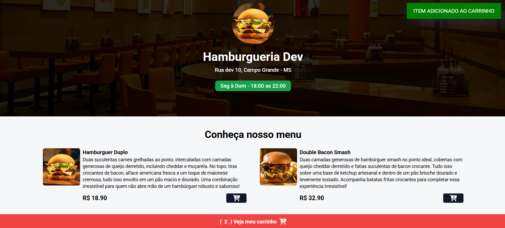
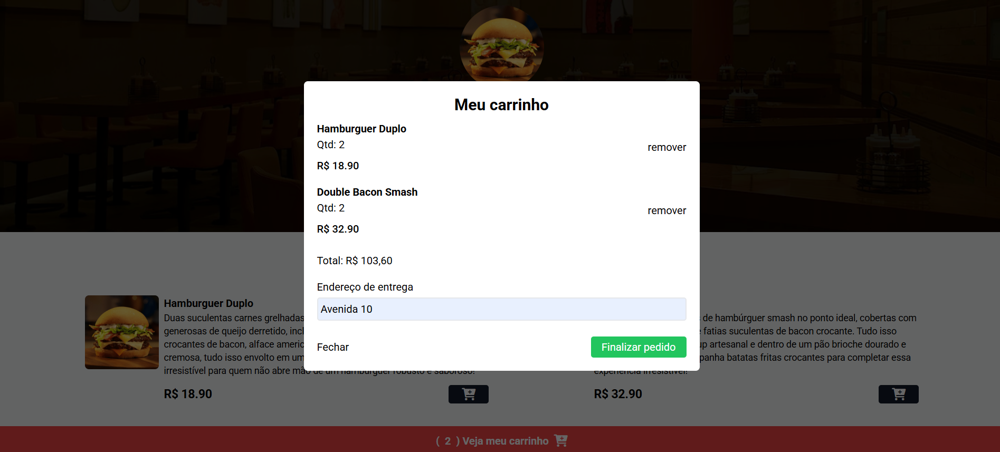

# 🍔 Hamburgueria Dev  

[](#)  
🔗 [Ver versão online](https://projeto-hamburgueria-dev-beta.vercel.app/)  

Uma aplicação web de hamburgueria fictícia, com foco em **experiência do usuário**, **interface responsiva** e **funcionalidades interativas de carrinho de compras**.  

---

## ✨ Visão Geral

A **Hamburgueria Dev** é um protótipo de e-commerce para restaurantes, simulando um sistema de pedido de hambúrgueres, bebidas e acompanhamentos.  

Funcionalidades principais:
- Layout **responsivo** (desktop, tablet e mobile)  
- Exibição de **menu** com itens e preços  
- **Carrinho de compras** interativo (adicionar/remover itens)  
- **Cálculo automático** do valor total  
- Formulário para inserir **endereço de entrega**  
- Experiência visual agradável e amigável  

---

## 🖼️ Capturas de Tela

<p align="center">
  
  
</p>


---

## 🛠️ Tecnologias Utilizadas

- **HTML5, CSS3 e JavaScript**  
- **Framework de Frontend** (ex: React, Next.js – ajuste conforme o seu projeto)  
- **Estilização** (CSS Modules, Tailwind, Styled Components – ajuste conforme usado)  
- **Deploy**: [Vercel](https://vercel.com/)  

---

## 🚀 Como Executar o Projeto Localmente

```bash
# 1. Clone este repositório
git clone https://github.com/seu-usuario/nome-do-repositorio.git

# 2. Acesse a pasta do projeto
cd nome-do-repositorio

# 3. Instale as dependências
npm install
# ou
yarn

# 4. Execute o projeto em modo de desenvolvimento
npm run dev
# ou
yarn dev

# 5. Acesse no navegador
http://localhost:3000
